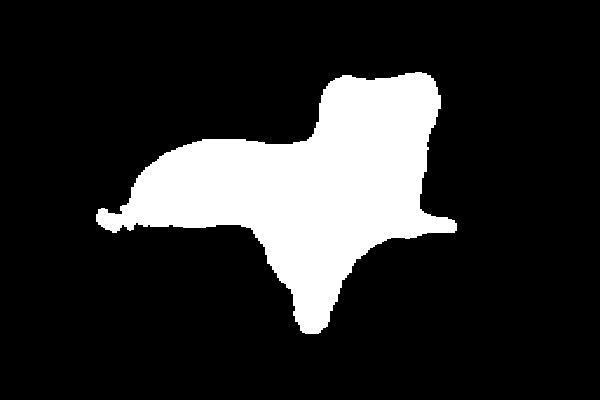
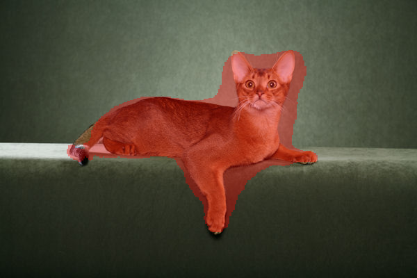

# Image Segmentation From Scratch

This project trains a binary semantic segmentation model in PyTorch using a custom U-Net and the Oxford-IIIT Pet segmentation dataset.

## Setup

```bash
python3 -m venv .venv
source .venv/bin/activate
pip install -e .
```

## Train

```bash
python -m segmentation.train --config configs/oxford_pet_unet.yaml
```

The first run can download the Oxford-IIIT Pet dataset into `data/`.
Running from a fresh checkout now works directly; `pip install -e .` is still recommended if you want the package installed into your environment.

## Evaluate

```bash
python -m segmentation.evaluate \
  --config configs/oxford_pet_unet.yaml \
  --checkpoint outputs/<run_name>/best.pt
```

## Predict

```bash
python -m segmentation.predict \
  --config configs/oxford_pet_unet.yaml \
  --checkpoint outputs/<run_name>/best.pt \
  --input path/to/image_or_directory \
  --output outputs/preds
```

Prediction saves a binary mask and an overlay for each image.

## Example Output

Original input (`Abyssinian_1.jpg`):


Predicted binary mask:



Predicted overlay:


